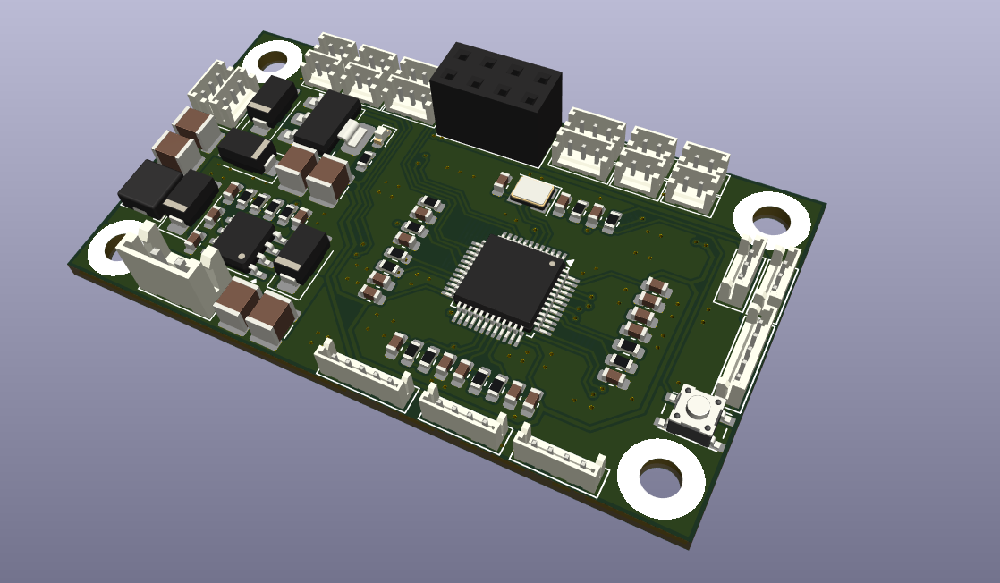
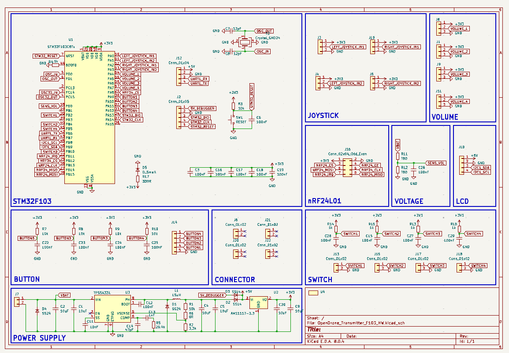
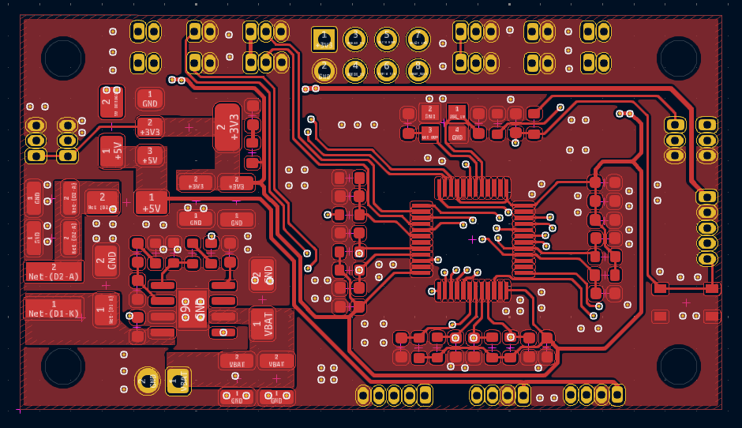
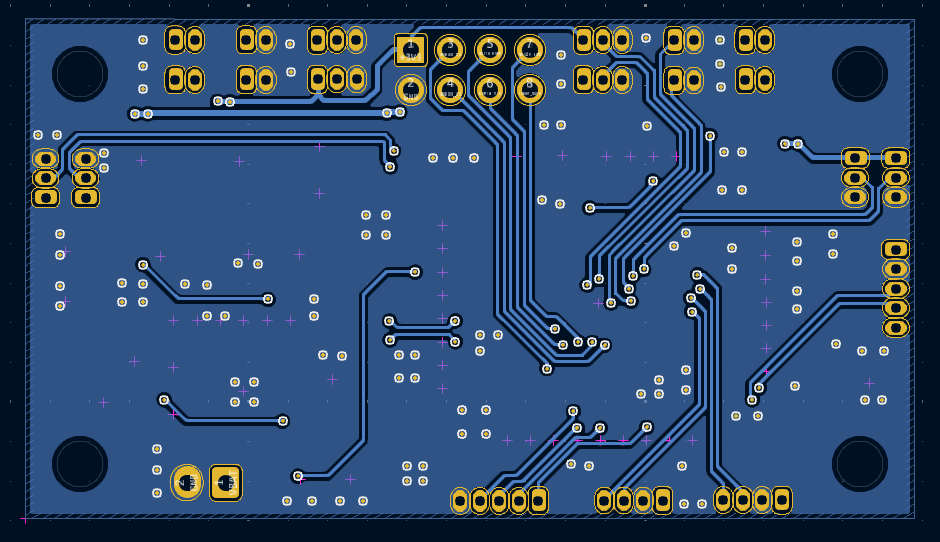
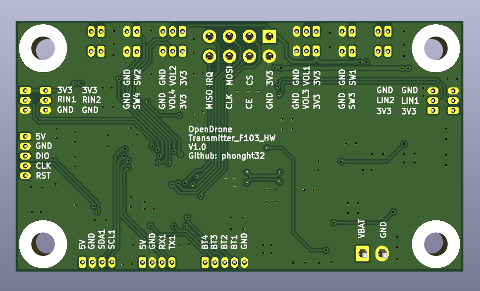
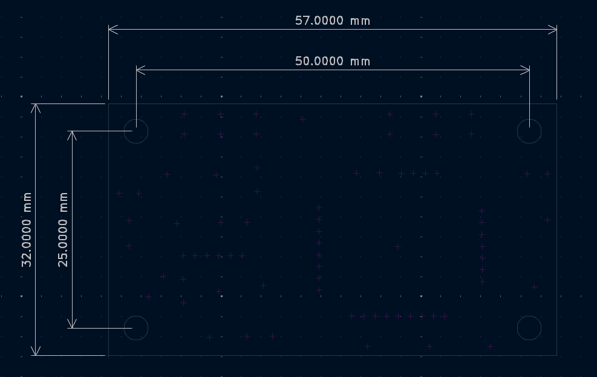

# OpenDrone_Transmitter_F103_HW

### Overview

OpenDrone Project - Transmitter hardware using STM32F103.

### Specifications

### Layout/Pin map

### Design

#### Schematic

#### PCB

F.Cu

B.Cu

#### 3D top

#### 3D bottom

#### Dimension

### Bill of materials (BOM)

[Download v1.0](Assets/BOM/OpenDrone_Transmitter_F103_HW_v1.0.xlsx)

### Gerber

[Download v1.0](Assets/Gerber/Gerber_OpenDrone_Transmitter_F103_HW_v1.0.zip)
